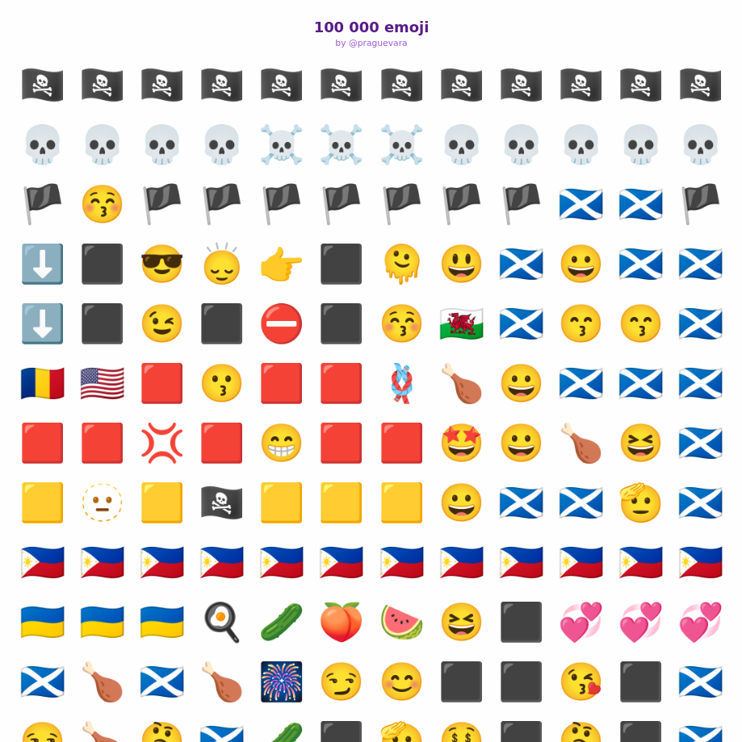

+++
title = "Emoji Graffiti"
date = 2024-09-15
+++

Since a friend told me in his company they were using Elixir, I decided to give it a try. I had heard it was a functional programming language, and although it's weakly typed, I thought it would be a good language to learn.

Around the same time, the website [One Million Checkboxes](https://onemillioncheckboxes.com/) was getting popular, so I took some inspiration from it as well as Reddit Place to create [Emoji Graffiti](https://emoji.praguevara.dev/).

It's basically a grid of emoji that you can edit. When you click on a cell, it lets you choose an emoji and replace the one that was there. The changes are automatically propagated to all connected clients, and the state is saved to a PostgreSQL database.

I shared the link on reddit and a few hundred people joined and starting graffitiing. I was surprised with the low quantity of phallic drawings (2) as well as the lack of vandalism in general. There were also a few works of art, such as a double helix crab structure that spanned for a few thousand rows, or a _Hail Satan_ graffiti.



## The technology

The site is deployed on [Fly.io](https://fly.io/) and the source code is available on [GitHub](https://github.com/praguevara/emoji-graffiti).

Emoji Graffiti is built using Elixir and the Phoenix framework, which provides a robust foundation for real-time web applications. Here's a breakdown of the key technologies and components:

1. **Elixir and Phoenix**: The core of the application is written in Elixir, utilizing the Phoenix framework for web development. Phoenix's LiveView feature is particularly useful for creating interactive, real-time experiences without writing complex JavaScript.
2. **PostgreSQL**: The application uses PostgreSQL as its database to store the emoji grid state. This is configured in the `config/dev.exs` file.

```elixir
config :emoji_graffiti, EmojiGraffiti.Repo,
  username: System.get_env("DB_USERNAME", "postgres"),
  password: System.get_env("DB_PASS", "postgres"),
  hostname: System.get_env("DB_HOST", "localhost"),
  database: System.get_env("DB", "emoji_graffiti"),
  stacktrace: true,
  show_sensitive_data_on_connection_error: true,
  pool_size: 10
```

3. **Docker Compose**: For local development and testing, I used Docker Compose to set up a PostgreSQL database. This made it easy to create a consistent development environment across different machines. Here's a snippet from the `docker-compose.yml` file:

```yaml
services:
  db:
    image: postgres
    environment:
      - POSTGRES_USER=postgres
      - POSTGRES_PASSWORD=postgres
    ports:
      - "5432:5432"
```

4. **Nix**: To ensure a consistent development environment, I used Nix with a `flake.nix` configuration. This allowed me to specify all the necessary dependencies and tools:

```nix
{
  description = "A flake for building development environment of Phoenix project.";

  inputs = {
    nixpkgs.url = "github:NixOS/nixpkgs/master";
    flake-utils.url = "github:numtide/flake-utils";
  };

  outputs = { self, nixpkgs, flake-utils }:
    flake-utils.lib.eachDefaultSystem (system:
      let
        pkgs = nixpkgs.legacyPackages.${system};
      in
      with pkgs; {
        devShells.default = mkShell {
          buildInputs = [
            beam.packages.erlang_24.elixir_1_16
            elixir-ls
            tailwindcss-language-server
            vscode-langservers-extracted
            nodePackages.typescript-language-server
            pkgs.nodePackages.prettier
            tailwindcss
            nodejs
            docker-compose
            flyctl
          ] ++ lib.optionals stdenv.isLinux [
            libnotify
            inotify-tools
          ] ++ lib.optionals stdenv.isDarwin [
            terminal-notifier
            darwin.apple_sdk.frameworks.CoreFoundation
            darwin.apple_sdk.frameworks.CoreServices
          ];
        };
      }
    );
}
```

5. **GenServer**: The `EmojiGraffiti.Wall` module uses Elixir's GenServer to manage the state of the emoji grid. This allows for efficient handling of concurrent updates and queries:

```elixir
defmodule EmojiGraffiti.Wall do
  use GenServer
  import Ecto.Query
  alias EmojiGraffiti.Repo
  alias EmojiGraffiti.Cell

  require Logger

  @max_count 100_000 - 1

  def start_link(_init_arg) do
    GenServer.start_link(__MODULE__, %{}, name: __MODULE__)
  end

  def get(id) when id >= 0 and id <= @max_count do
    GenServer.call(__MODULE__, {:get, id})
  end

```

6. **LiveView**: The `EmojiGraffitiWeb.WallLive` module implements the LiveView functionality, handling real-time updates and user interactions:

```elixir
defmodule EmojiGraffitiWeb.WallLive do
  use Phoenix.LiveView

  alias EmojiGraffiti.Wall
  alias EmojiGraffiti.Validator

  @column_size 12
  @chunk_size 300 * @column_size

  import EmojiGraffitiWeb.CellComponent, only: [cell: 1]

  def mount(_params, _session, socket) do
    if connected?(socket) do
      Phoenix.PubSub.subscribe(EmojiGraffiti.PubSub, "emoji_updates")
    end

    emojis = Wall.get_many(0, @chunk_size - 1)
    rows = group_emojis_into_rows(emojis)

    socket =
      socket
      |> assign(:start, @chunk_size)
      |> stream(:rows, rows)

    {:ok, socket}
  end

```

7. **PubSub**: Phoenix's PubSub system is used to broadcast emoji updates to all connected clients:

```elixir
Phoenix.PubSub.broadcast(
  EmojiGraffiti.PubSub,
  "emoji_updates",
  {:emoji_changed, id, emoji}
)
```

8. **Emoji Picker**: The application uses the life-saving [emoji-picker-element](https://nolanlawson.github.io/emoji-picker-element) library for the emoji selection interface:

```typescript
import { Picker } from "../vendor/emoji-picker-element"
```

9. **Tailwind CSS**: The UI is styled using Tailwind CSS, as evident from the class names in the HTML templates:

```html
<div class="flex flex-col h-svh overflow-hidden bg-purple-50 bg-opacity-15" id="emoji-container">
  <div class="flex-grow overflow-auto" id="scrollable-content">
    <div class="flex justify-center">
      <div class="flex flex-col items-center text-xl mt-6 mb-2">
        <h1 class="text-1xl text-center mx-8 text-purple-900 font-semibold">
          100 000 emoji
        </h1>
        <h3 class="text-xs opacity-75 text-purple-700">
          by <a href="https://github.com/praguevara" target="_blank">@praguevara</a>
        </h3>
      </div>
    </div>
    <div class="relative max-w-screen-lg mx-auto">
      <div id="emoji-grid" phx-hook="EmojiGrid" class="grid px-4" phx-update="stream">

```

10. **Deployment**: The application is deployed on Fly.io, which provides an easy-to-use platform for hosting Elixir applications.

```toml
# fly.toml app configuration file generated for emoji-graffiti on 2024-08-20T12:48:26+02:00
#
# See https://fly.io/docs/reference/configuration/ for information about how to use this file.
#

app = 'emoji-graffiti'
primary_region = 'mad'
kill_signal = 'SIGTERM'

[build]

[deploy]
  release_command = '/app/bin/migrate'

[env]
  PHX_HOST = 'emoji.praguevara.dev'
  PORT = '8080'

[http_service]
  internal_port = 8080
  force_https = true
  auto_stop_machines = 'stop'
  auto_start_machines = true
  min_machines_running = 0
  processes = ['app']

  [http_service.concurrency]
    type = 'connections'
    hard_limit = 1000
    soft_limit = 1000

[[vm]]
  memory = '1gb'
  cpu_kind = 'shared'
  cpus = 1

```
