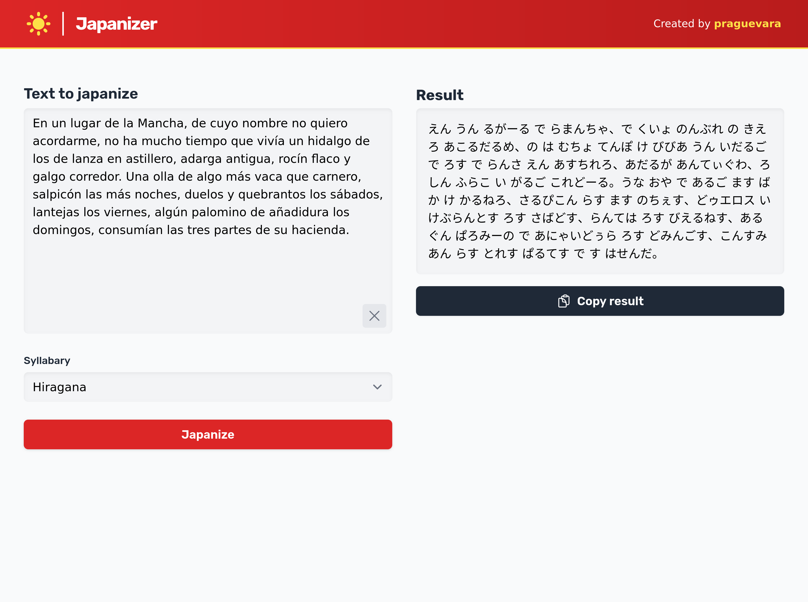

+++
title = "I built a ChatGPT wrapper to phonetically transcribe text into Japanese"
date = "2024-10-17"

[taxonomies]
tags = ["elixir", "phoenix"]
+++



A friend to me told me about their method for learning Japanese. They copied and pasted famous texts (say, the first chapter of _El Quijote_) and then asked ChatGPT to phonetically transcribe them into Japanese script. Since Spanish is
phonetically very similar to Japanese, the output can be quite close, and they
used this method to recognize Japanese script.

Besides Kanji, which are Chinese characters, Japanese uses another two scripts,
_Hiragana_ and _Katakana_. They represent vowels, syllables and the letter n for some reason.

Anyways, I thought that would be a cool side project and a good exercise in Elixir, Phoenix, and LiveView.

Check it out at [Japanizer](https://japanizer.praguevara.dev)!

## Features

- Streaming responses from OpenAI's API with [openai](https://hex.pm/packages/openai).
- Rate limiting per IP address using [Hammer](https://github.com/ExHammer/hammer).
- Cool and responsive design using [TailwindCSS](https://tailwindcss.com/) (I think).
- Multi-language support and internationalization with [CLDR](https://cldr.unicode.org/index) and [Gettext](https://hexdocs.pm/gettext/Gettext.html). The site changes language based on the browser's locale.
- Extensive telemetry and logging with [Prometheus](https://hexdocs.pm/prom_ex/readme.html), integrated into Fly.io's Grafana.

## Technology

The first thing I did was to set up a Nix flake. This allowed me to have all
dependencies in one place, with no system conflicts or weird bugs. Nix is pretty cool.

I then set up a basic Phoenix project, without a DB or authentication, with a LiveView that would handle the transcription. I still used Ecto for validation.

Integrating OpenAI was pretty straightforward. Getting streaming to work was a bit tricky, since I had to pass the config explicitly to make it work.

I had Claude generate the prompt and a few examples for the API, which worked pretty well, since I can barely read _Hiragana_.

For streaming the results back to the frontend, I used the `push_event` pattern to send the new deltas as they came in. I then set up a hook at the `app.js` file, which appended the new text to the existing text. I had to convert the newlines to `<br>` tags to make it work nicely with the HTML. At the start of the project I was sending the whole text each time a new chunk arrived, but this was clearly not a good idea since it's `O(n^2)`, and it started causing megabytes of data to be sent to the client.

I wanted to limit the number of requests per IP address to avoid abuse, so I
used [Hammer](https://github.com/ExHammer/hammer). The library is quite simple, and worked out of the box. I had issues trying to get the remote IP address from the LiveView with Fly. I found out about [remote_ip](https://hexdocs.pm/remote_ip/RemoteIp.html), and had to wrestle with it for a bit to get it to work. I had to pass the `:x_headers` to LiveView like so:

```elixir
  socket "/live", Phoenix.LiveView.Socket,
    websocket: [connect_info: [:x_headers, session: @session_options]],
    longpoll: [connect_info: [:x_headers, session: @session_options]]
```

Then, in the `mount` function, I got the IP address from the socket.

```elixir
    proxies = [] # A couple of IPs that I got from Fly.io's dashboard
    ip =
      get_connect_info(socket, :x_headers)
      |> RemoteIp.from(proxies: proxies)
      |> :inet.ntoa()
      |> to_string()
```

This almost worked, but I kept getting an IP that wasn't correct. After some
investigation, I found out that the IP was from Cloudflare, and I had forgotten
to turn proxy off.

For internationalization, I found [Gettext](https://hexdocs.pm/gettext/Gettext.html) to be quite easy to use. It has a couple of mix tasks to create the translation files, and then I used Claude to generate the translations for each language. I then used CLDR to find out the appropriate translation according to the browser's locale.

## Hosting

I hosted the app on Fly.io, using a custom DNS set through Cloudflare. I'm really quite liking Fly.io so far. For these kinds of projects, you get a very nice integration with Elixir, managed Postgres, logs, metrics and tons of features.

I also experimented with setting up metrics. I added a few:

```elixir
# Japanizer metrics
counter("japanizer.japanize.count",
    description: "The number of times the japanize function is called",
    tags: [:script]
),
counter("japanizer.japanize.rate_limit.count",
description:
    "The number of times the japanize function is called and the rate limit is exceeded"
),
distribution("japanizer.japanize.text_length",
    description: "The length of the text being japanized",
    unit: :character
),
distribution("japanizer.japanize.duration",
    description: "The time it takes to complete a japanization",
    unit: {:native, :millisecond}
),
counter("japanizer.japanize.error.count",
    description: "The count of errors during japanization",
    tags: [:error_type]
)
```

I could see them in LiveDashboard, but I wanted to be able to access them
with Fly.io's Grafana. For this, I found [prom_ex](https://hexdocs.pm/prom_ex/readme.html), which is a Prometheus exporter for Elixir. I had never worked with
Prometheus or Grafana before, but it was quite easy to set up and get working.

## Conclusion

I'm quite happy with the result. I think the project is quite minimal and pretty robust, and since the goal was to have fun and learn something new, I consider it a success.
